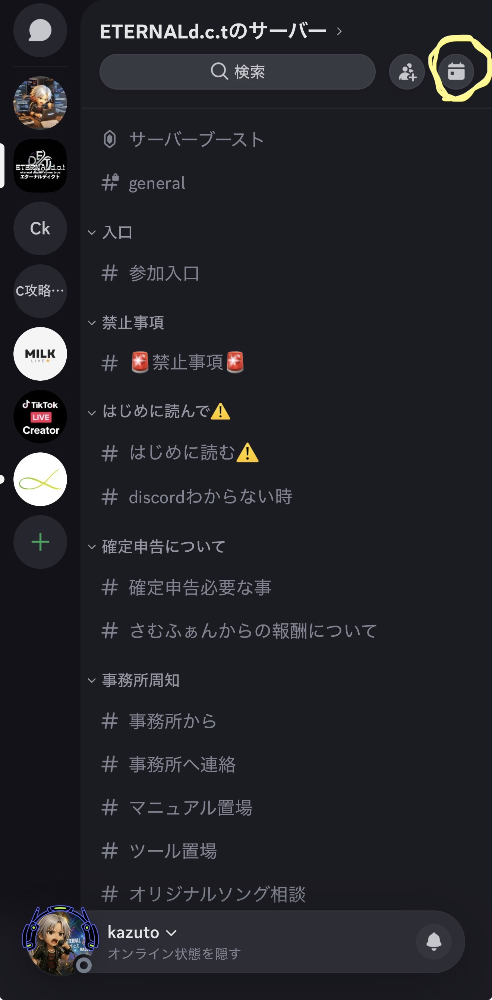
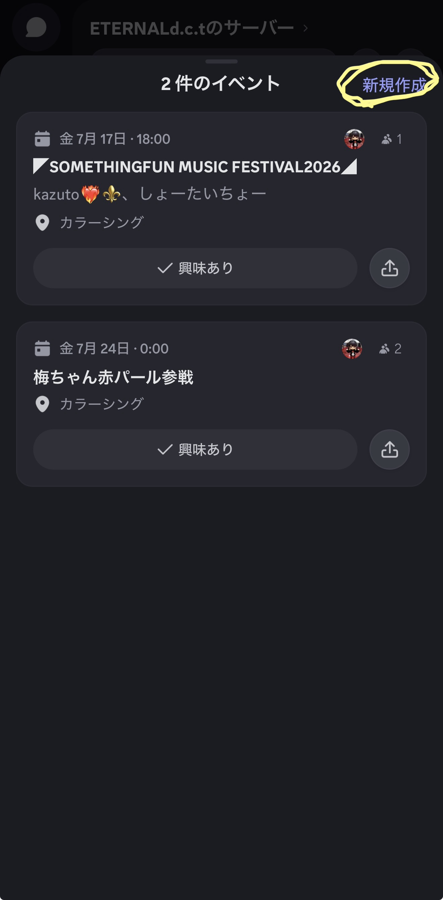
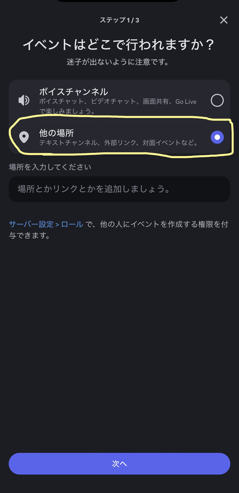
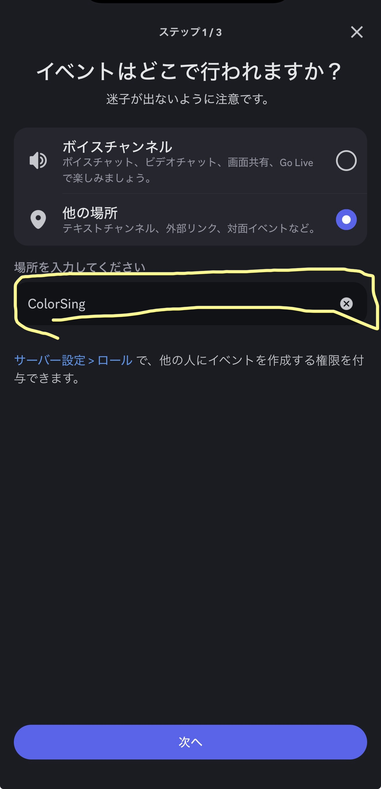
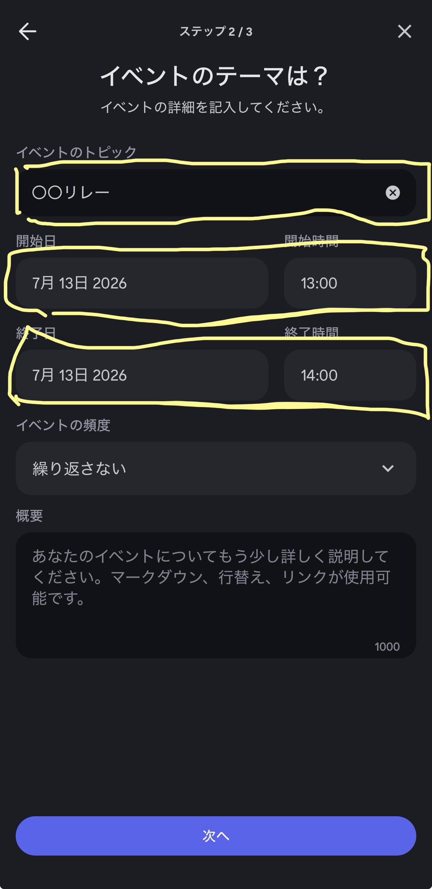
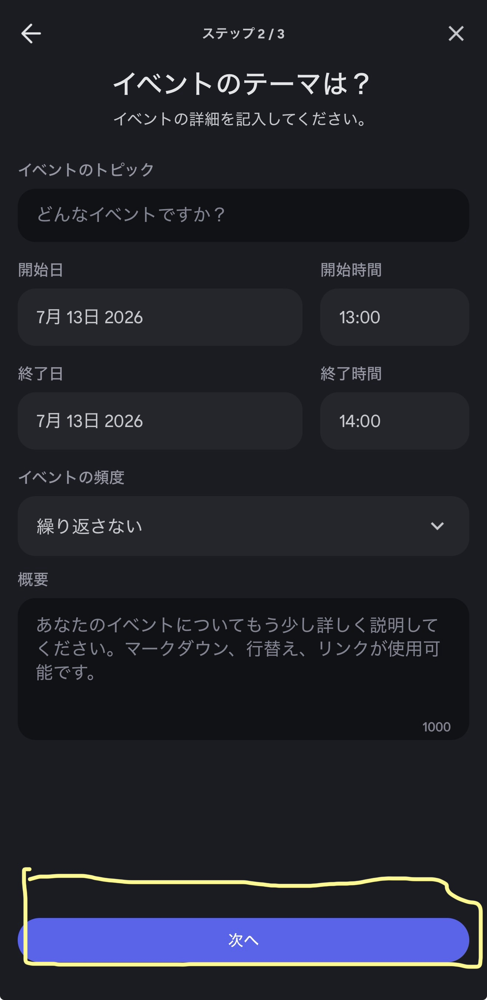
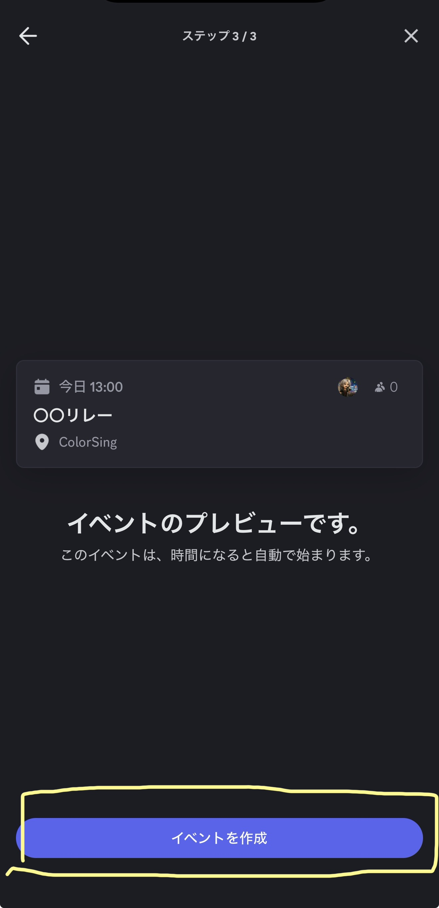
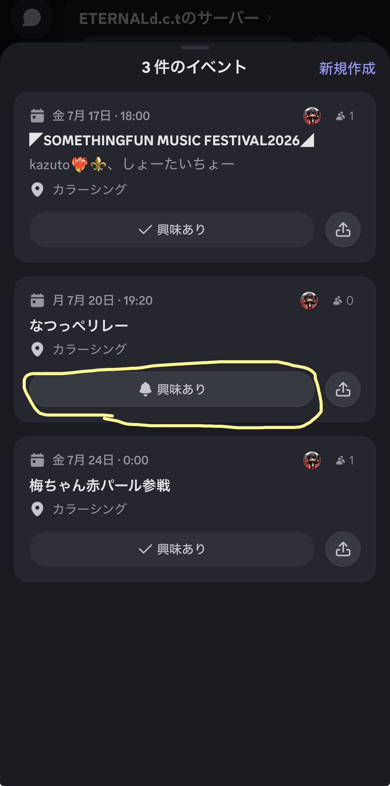

# Discordイベントの作り方マニュアル

サーバーにイベントを登録する手順を、実際の画面つきで順番に解説します。
スマホアプリの画面をもとにしています（所要時間 約2分・全8ステップ）。

---

## ステップ01 — イベント一覧を開く

サーバーを開き、画面右上の**カレンダー（📅）アイコン**をタップします。
これがイベントの入口です。

---

## ステップ02 — 「新規作成」をタップ

イベント一覧が開いたら、右上の**「新規作成」**をタップします。

---

## ステップ03 — 場所の種類を選ぶ

「イベントはどこで行われますか？」の画面で**「他の場所」**を選びます。
テキストチャンネル・外部リンク・対面イベントなどはこちらです。

> 💡 配信や通話でやる場合は「ボイスチャンネル」を選びます。

---

## ステップ04 — 場所を入力

**「場所を入力してください」**の欄に、会場名やリンクを入力します（例：ColorSing）。
入力できたら、画面下の**「次へ」**をタップします。

---

## ステップ05 — イベント名と日時を入力

**イベントのトピック**（イベント名）を入力します。
続けて**開始日・開始時間**、**終了日・終了時間**を設定します。

> 💡 「概要」は任意です。詳しい説明を書きたいときだけ入力すればOK。

---

## ステップ06 — 「次へ」をタップ

入力内容がそろったら、画面下の**「次へ」**をタップします。

---

## ステップ07 — 内容を確認して作成

イベントの**プレビュー**が表示されます。
内容に問題がなければ、画面下の**「イベントを作成」**をタップします。

> 💡 このイベントは、開始時間になると自動で始まります。

---

## ステップ08 — 完成！

イベント一覧に追加されれば完了です。お疲れさまでした！
メンバーは**「興味あり」**を押すと、開始時に通知を受け取れます。

---

わからないときは **#discordわからない時** で質問してください。
